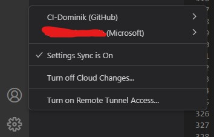

# Restaurant Management System
This restaurant management system was designed to manage the data of customers, products, sales, bookings and tables of a client's business.

The live system can be viewed here: [Link to the Restaurant Management System](https://pp3-management-system-30090303934b.herokuapp.com/ "Link to the live website")

---

## **TABLE OF CONTENTS**

[**BRIEFING**](#briefing)
  * PH

 

[**USER EXPERIENCE**](#user-experience)
  * PH
    
 

[**FEATURES**](#features)
  * PH

 

[**MENU STRUCTURE**](#menu-structure)
  * PH
    
 

[**TECHNOLOGIES**](#technologies)
  * [Python](#python)
  * [MySQL](#mysql)
  * [MySQL Connector](#mysql-connector)
  * [OS](#os)
  * [dotenv](#dotenv)
  * [Visual Studio Code](#visual-studio-code)
  * [GitHub](#github)
  * [All-Inkl](#all-inkl)
    
 

[**TESTING**](#testing)
  * PH
    
 

[**VALIDATOR TESTING**](#validator-testing)
  * [PEP8 Linter](#pep8-linter)

 

[**BUGS**](#bugs)
  * [Unfixed bugs](#unfixed-bugs)

 

[**DEPLOYMENT**](#deployment)
  * [GitHub](#github-1)
  * [Heroku](#heroku)
    
 

[**CREDITS**](#credits)
  * [Techsini](#techsini)
  * [PEP8 Linter](#pep8-linter-1)
  * [W3Schools](#w3schools)
  * [YouTube](#youtube)
  * [ChatGPT](#chatgpt)
  * [Visual Studio Code](#visual-studio-code-1)
  * [All-Inkl](#all-inkl-1)

---

## **BRIEFING**

## Heading
* PH

---

## **USER EXPERIENCE**

## Heading
* PH

---

## **FEATURES**

## Heading
* PH

 

---

## **MENU STRUCTURE**

## Heading
* PH

 

---

## **TECHNOLOGIES**

### Python
* Python was used to create the program's logic

### MySQL
* MySQL was used to deploy a database to access all needed pieces of information.

### MySQL Connector
* The Python module mysql-connector was used to connect to the MySQL database and display errors for bugfixing.

### OS
* The Python module os was used to access operating system files.

### dotenv
* The Python module dotenv was used to import environmental variables to secure the database login and read the needed data.

### Visual Studio Code
* Visual Studio Code was used to clone the GitHub repository, edit the homepage's code and commit / push the results to GitHub.

### GitHub
* GitHub was used to store the homepage's files. Everything was deployed using GitHub Pages.

### All-Inkl
* All-Inkl was used to host the MySQL database.

---

## **TESTING**

## Heading

| Testing method | Expected result | Actual result |
|:-------------:|:---------------:|:-------------:|
| TEXT | TEXT | TEXT |
| TEXT | TEXT | TEXT |
| TEXT | TEXT | TEXT |

---

## **VALIDATOR TESTING**

### PEP8 Linter
* The code was checked for errors using PEP8 Linter. No errors occured while testing.

 

---

## **BUGS**

## Unfixed bugs
* PH

---

## **DEPLOYMENT**

## GitHub

### Visual Studio Code connection
* A connection between Visual Studio Code and GitHub was established using the built-in function to include the ability to clone, stage, commit and push content directly to GitHub.
Once you start Visual Studio Code with no connection, you simply need to click on the person icon in the lower left corner and select "GitHub". From there, you can connect your existing account to Visual Studio Code.

 

### Cloning, committing and pushing via Visual Studio Code
* Visual Studio code was used to stage all changed files and commit them with an included message directly to GitHub.

 

### Deployment via GitHub Pages
* Once a version that should be visible on the internet has been established, to deploy a page, one needs to visit the GitHub repository that is used to store all data of the project.

 

On the top, there is an option that says *Settings*. In this menu, it is possible to deploy the page using the *Pages* sub-menu.

 

Once one clicks on the *Pages* sub-menu, a new page will appear. On this one, one can select the branch of the project which contains the main data to deploy to GitHub Pages. In this case, the branch *Main* was used.

 

With the right branch selected, the input needs to be saved via the *Save* button.

 

After the deployment, a link to the deployed page can be found on the front page of the GitHub repository. With a click on it to reveal the link that takes the visitor to the live page.

 

## Heroku

PH ---------------------------------

---

## **CREDITS**

## [Techsini](https://techsini.com/multi-mockup/index.php)
* Used to create the mockup in the readme file.

## [PEP8 Linter](https://pypi.org/project/pep8/)
* Used to verify Python code.

## [W3Schools](https://www.w3schools.com/)
* Used to lookup tips for the code.

## [YouTube](https://youtube.com)
* Videos for understanding some code areas.

## [ChatGPT](https://chatgpt.com/)
* Used for deepening the understanding of some Python and database concepts.

## [Visual Studio Code](https://code.visualstudio.com/)
* Used for code editing.

## [All-Inkl](https://https://all-inkl.com/)
* Used to host the MySQL database.