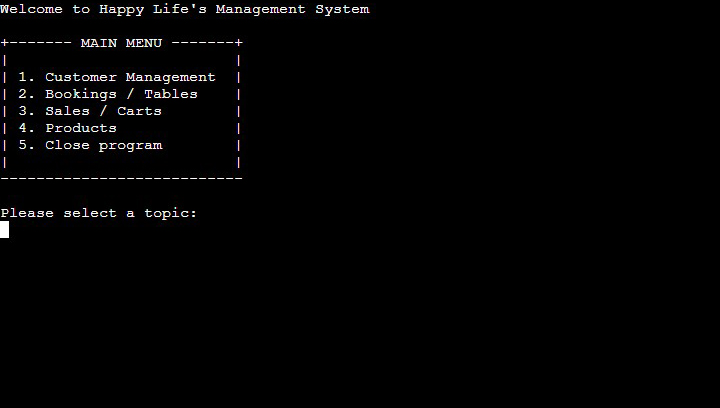
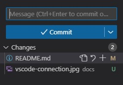

# Restaurant Management System
This restaurant management system was designed to manage the data of customers, products, sales, bookings and tables of a client's business.

The live system can be viewed here: [Link to the Restaurant Management System](https://pp3-management-system-30090303934b.herokuapp.com/ "Link to the live website")

---

## **TABLE OF CONTENTS**

[**BRIEFING**](#briefing)
  * [Happy Life's Management System](#happy-lifes-management-system)
  * [Management of customers](#management-of-customers)
  * [Bookings](#bookings)
  * [Sales](#sales)
  * [Products](#products)

 

[**PLANNING**](#planning)
  * [The needs for Happy Life's management system](#the-needs-for-happy-lifes-management-system)

 

[**USER EXPERIENCE**](#user-experience)
  * [Easy access and clear division](#easy-access-and-clear-division)
    
 

[**FEATURES**](#features)
  * [Main Menu](#main-menu)
  * [Customers Menu](#customers-menu)
  * [Bookings / Tables Menu](#bookings--tables-menu)
  * [Sales / Carts Menu](#sales--carts-menu)
  * [Products Menu](#products-menu)
  * [Database Structure](#database-structure)
    
 

[**TECHNOLOGIES**](#technologies)
  * [Python](#python)
  * [MySQL](#mysql)
  * [MySQL Connector](#mysql-connector)
  * [OS module](#os-module)
  * [RE module](#re-module)
  * [dotenv](#dotenv)
  * [Colorama](#colorama)
  * [datetime](#datetime)
  * [Visual Studio Code](#visual-studio-code)
  * [GitHub](#github)
  * [All-Inkl](#all-inkl)
    
 

[**TESTING**](#testing)
  * [Flake8](#flake8)
    
 

[**VALIDATOR TESTING**](#validator-testing)
  * [PEP8 Linter](#pep8-linter)

 

[**BUGS**](#bugs)
  * [Unfixed bugs](#unfixed-bugs)

 

[**DEPLOYMENT**](#deployment)
  * [GitHub](#github-1)
    * [Visual Studio Code connection](#visual-studio-code-connection)
    * [Cloning, committing and pushing via Visual Studio Code](#cloning-committing-and-pushing-via-visual-studio-code)
    * [Deployed page on GitHub](#deployed-page-on-github)
  * [Heroku](#heroku)
    
 

[**CREDITS**](#credits)
  * [Techsini](#techsini)
  * [PEP8 Linter](#pep8-linter-1)
  * [W3Schools](#w3schools)
  * [YouTube](#youtube)
  * [ChatGPT](#chatgpt)
  * [Visual Studio Code](#visual-studio-code-1)
  * [All-Inkl](#all-inkl-1)

---

## **BRIEFING**

## Happy Life's Management System
* Happy Life, a local coffee shop reached out regarding their plan to implement a management system for their business. As their business is growing, they want to decrease their workload for bureaucratic affairs. Several topics were mentioned that needed improvement.

### Management of customers
* People regularly contact Happy Life to book tables and the company wants to simplify the process. When a potential customer contacts them, they want to be able to register a new customer and edit their information. It should also be possible to assign a person to a table and give the process a booking ID.

### Bookings
* Happy Life's booking system should be able to book a table for a registered customer or guests. It should also take the amount of customers in consideration and reply with open tables for the given amount. The team should always be able to get an overview over the amount of tables available and the bookings made in their system that are not yet finished.

### Sales
* The employees should be able to add a product to a cart that each of their visitors gets assigned, either through a booking or a direct purchase. The removal of said products should also be possible to manage returns and unwanted or unusable items. The purchase should be finished through their system, taking into account the table ID, booking ID and the visitor's carts.

### Products
* Happy Life's product catalog is changing from time to time, so a flexible system should adapt to their needs. It should be possible to add a product to the system, update it, update the stock or check on the amount that is left in their storage.

---

## **PLANNING**

## The needs for Happy Life's management system
* The company has needs that need to be fulfilled, so a strategical planning process was made. The platform will be used by coffee staff only, so the interface should include only management topics as customers will not operate the system. Several categories will simplify and divide the menu into controllable, user-friendly chunks. 
A database will save all needed pieces of information as a reliable and secure source. MySQL will be used, as it provides the ability to separate the data into clear columns that have the ability of being nullable or not. 
A password should protect the system, in case a customer gets access to the terminal.

---

## **USER EXPERIENCE**

## Easy access and clear division
* The user will immediately be able to complete their needed task without unnecessary pieces of information. A menu with all categories welcomes them. With the help of numbers, the user will be able to navigate through the several menus. 
The structure is divided into management for customers, bookings, sales and products. Each of those menus will have their own set of bullet points. For example, in the customer panel, it is possible to add a new customer, edit their data or search for a specific person, based on provided pieces of information like a name, email address or phone number. 
To inform the user of possible mistakes, every menu input is secured by catching wrong inputs or wrong types of inputs like texts instead of a whole number.

---

## **FEATURES**

## Main Menu
* The main menu is used as the access point for all sub-menus. From here, the user can reach every stage of the booking or sale progress that they like.

 

## Customers menu
* The customers menu is used to search for a customer using data like the name (with possible duplicates but a listing of all customers with that name to choose one), email address, phone number or ID. The user can also insert new data, update them or show a scrollable list of all customers. Deletion of data is prohibited, as all employees get access to the terminal. Such data need to be erased in the MySQL management tool.

 

## Bookings / Tables Menu
* In the menu for bookings and tables, the user is able to book a table for either a new customer, an exisiting one or just a guest who does not want to be inside the database. An overview over the available tables is present and open bookings can be displayed. Tables are free again after the purchase is complete.

 

## Sales / Carts Menu
* The sales and carts menu is used to add a product to an already exisiting cart, walk-in purchases can be completed without the need for a booking, products can be removed from an exisiting cart (also from walk-in carts), purchases can be completed and a list of all sales can be viewed in ascending order.

 

## Products Menu
* The products menu can be used to add products to the database, update existing products and check the wares in a scrollable list and sorted by category.

 

## Database Structure
* All-Inkl was used to host a MySQL database. The structure represents the final variant of the available database for the terminal project.

 

---

## **TECHNOLOGIES**

### Python
* Python was used to create the program's logic

### MySQL
* MySQL was used to deploy a database to access all needed pieces of information.

### MySQL Connector
* The Python module mysql-connector was used to connect to the MySQL database and display errors for bugfixing.

### Pycodestyle (Former PEP8)
* The pycodestyle module was used to verify the code for pythonic structure.

### Flake8
* The Flake8 extension of Visual Studio Code was used to get a constant feedback about pythonic style.

### Black
* The black module was used to format some of the code.

### OS module
* The Python module os was used to access operating system files.

### RE module
* The RE module was used to check for incorrect inputs for email addresses or phone numbers.

### dotenv
* The Python module dotenv was used to import environmental variables to secure the database login and read the needed data.

### Colorama
* Colorama was used to highlight texts in several colors to give emphasis.

### datetime
* datetime was imported to get the current date and insert it into a database table.

### Visual Studio Code
* Visual Studio Code was used to clone the GitHub repository, edit the homepage's code and commit / push the results to GitHub.

### GitHub
* GitHub was used to store the homepage's files. Everything was deployed using GitHub Pages.

### All-Inkl
* All-Inkl was used to host the MySQL database.

---

## **TESTING**

## General testing

| Testing method | Expected result | Actual result |
|:-------------:|:---------------:|:-------------:|
| Entering text into fields that require integer values | An error should appear and return the user to the beginning of the loop | Pass |
| Entering negative values into fields that require positive values | An error should appear and return the user to the beginning of the loop | Pass |
| Entering values outside of the selection range | An error should appear and return the user to the beginning of the loop | Pass |
| Entering numbers, texts and special signs into fields that require "y" or "n" | An error should appear and return the user to the beginning of the loop | Pass |
| Entering a wrong password when starting the program | Access should be denied | Pass |

## Main Menu

| Testing method | Expected result | Actual result |
|:-------------:|:---------------:|:-------------:|
| TEXT | TEXT | TEXT |
| TEXT | TEXT | TEXT |
| TEXT | TEXT | TEXT |

## Customer Management

| Testing method | Expected result | Actual result |
|:-------------:|:---------------:|:-------------:|
| TEXT | TEXT | TEXT |
| TEXT | TEXT | TEXT |
| TEXT | TEXT | TEXT |

## Tables / Bookings

| Testing method | Expected result | Actual result |
|:-------------:|:---------------:|:-------------:|
| TEXT | TEXT | TEXT |
| TEXT | TEXT | TEXT |
| TEXT | TEXT | TEXT |

## Sales / Carts

| Testing method | Expected result | Actual result |
|:-------------:|:---------------:|:-------------:|
| TEXT | TEXT | TEXT |
| TEXT | TEXT | TEXT |
| TEXT | TEXT | TEXT |

## Products

| Testing method | Expected result | Actual result |
|:-------------:|:---------------:|:-------------:|
| TEXT | TEXT | TEXT |
| TEXT | TEXT | TEXT |
| TEXT | TEXT | TEXT |

---

## **VALIDATOR TESTING**

### Flake8
* The code was checked for errors using the Flake8 extension for Visual Studio Code as a PEP8 control tool. No errors occured while testing the final product.

 

### Pycodestyle (Former PEP8)
* After erasing all bugs pointed out from Flake8, the document was again checked using Pycodestyle. No errors occured.

 

---

## **BUGS**

## Unfixed bugs
* When accessing the list of scrollable data, the user first needs to enter 0 to cancel the scrolling before the value can be provided. Many versions were tried but no solution was found to that problem at the time of deployment. This issue needs to be addressed in the future.

---

## **DEPLOYMENT**

## GitHub

### Visual Studio Code connection
* A connection between Visual Studio Code and GitHub was established using the built-in function to include the ability to clone, stage, commit and push content directly to GitHub.
Once you start Visual Studio Code with no connection, you simply need to click on the person icon in the lower left corner and select "GitHub". From there, you can connect your existing account to Visual Studio Code.

 

### Cloning, committing and pushing via Visual Studio Code
* Visual Studio code was used to stage all changed files and commit them with an included message directly to GitHub.

 

### Deployed page on GitHub
* The system is hosted via Heroku, but still available in the pages menu of GitHub.

## Heroku

PH ---------------------------------

---

## **CREDITS**

## [Techsini](https://techsini.com/multi-mockup/index.php)
* Used to create the mockup in the readme file.

## [Pycodestyle (Former PEP8)](https://pypi.org/project/pycodestyle/)
* Used to verify Python code.

## [Black](https://pypi.org/project/black/)
* Used to format the Python code.

## [drawsql](https://drawsql.app/)
* Used to create the database diagram.

## [Lucidchart](https://lucid.app/)
* Used to create flowcharts for the menu structure.

## [W3Schools](https://www.w3schools.com/)
* Used to lookup tips for the code.

## [YouTube](https://youtube.com)
* Videos for understanding some code areas.

## [ChatGPT](https://chatgpt.com/)
* Used for deepening the understanding of some Python and database concepts.

## [Visual Studio Code](https://code.visualstudio.com/)
* Used for code editing.

## [All-Inkl](https://all-inkl.com/)
* Used to host the MySQL database.